# KHAN2001

### Full-Stack Web Development · AI · Digital Products

🌱 Currently learning **Frontend Development**

---

## 🛠️ Tech Stack

---

## 🚀 Projects

| Project | Description | Technology |
|:---|:---|:---|
| 🐱 [Cats_VS_Dogs](https://github.com/Khan2001/Cats_VS_Dogs) | Image classification project based on VGG16 | Python · Keras · TensorFlow |
| 🌐 [Pure-Page](https://github.com/Khan2001/Pure-Page) | Personal homepage and early web development project | HTML · CSS · JavaScript · jQuery |
| 🎨 [Web-Design-Competition](https://github.com/Khan2001/Web-Design-Competition) | Web design competition project | HTML |
| 🏆 [2022-cnsoftbei-a3](https://github.com/Khan2001/2022-cnsoftbei-a3) | 2022 China Software Cup competition project | HTML |

---

## 📊 GitHub

---

**Build · Learn · Explore**

